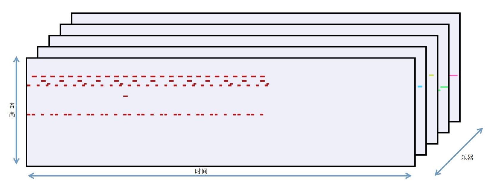
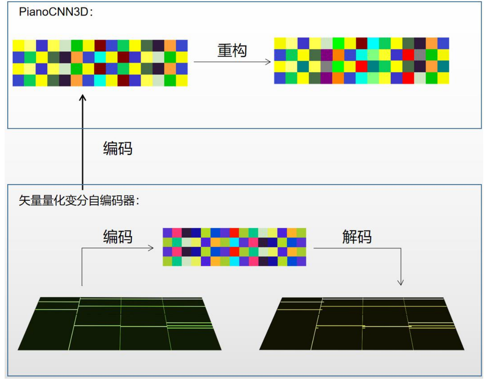
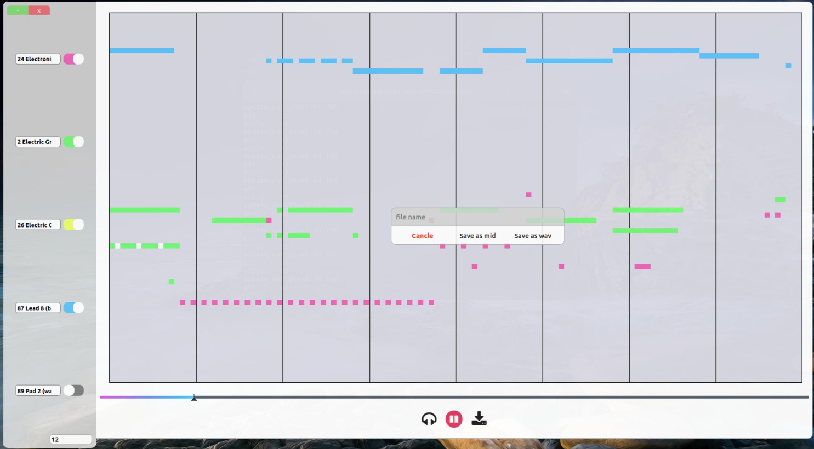

## 简介

- 训练演示notebook以及网络结构的定义在```./train```目录。播放器代码在```./user_interface```，播放器演示在```./demo```中。
- 项目使用了Pianoroll格式的乐谱数据，训练了一个VQ-VAE模型学会了音乐的低维表示（隐变量），和音乐隐变量的自回归生成模型。
<div align="center">

</div>

## 模型训练
- 通过自编码模型，通过将乐谱压缩成隐变量并重构成乐谱，得到一个编码器和解码器
- 训练一个自回归模型（PianoCNN3D），能通过上一段乐谱隐变量，生成下一段乐谱
<div align="center">

</div>
- 为了训练时自回归模型能够并行预测下一段乐谱的隐变量，使用了带掩码的3维卷积核（MASK A）。
<div align="center">

</div>

## 音乐生成播放器
- 使用PyQt开发了一个音乐播放器，用户可以选择5种乐器组合，后一键随机生成音乐。
- ```./demo/demo.mkv```中演示了，生成音乐，并在播放器进行播放，以及简单的乐器音色的编辑。
- ```demo```中也进一步演示了生成的piano可以导出为mid文件，在专业的音乐软件进行编辑。
<div align="center">

</div>

### 运行说明
请安装```./user_interface/requirements.txt```中的```python```依赖库后运行```python main.py```运行播放器

若使用的是conda环境时出现报错
```
OSError: .conda/envs/yourenv/lib/python3.10/site-packages/../../../././libstdc++.so.6: version `GLIBCXX_3.4.30' not found (required by /usr/lib/libfluidsynth.so.3)
```
可尝试```conda install -c conda-forge libstdcxx-ng```解决

